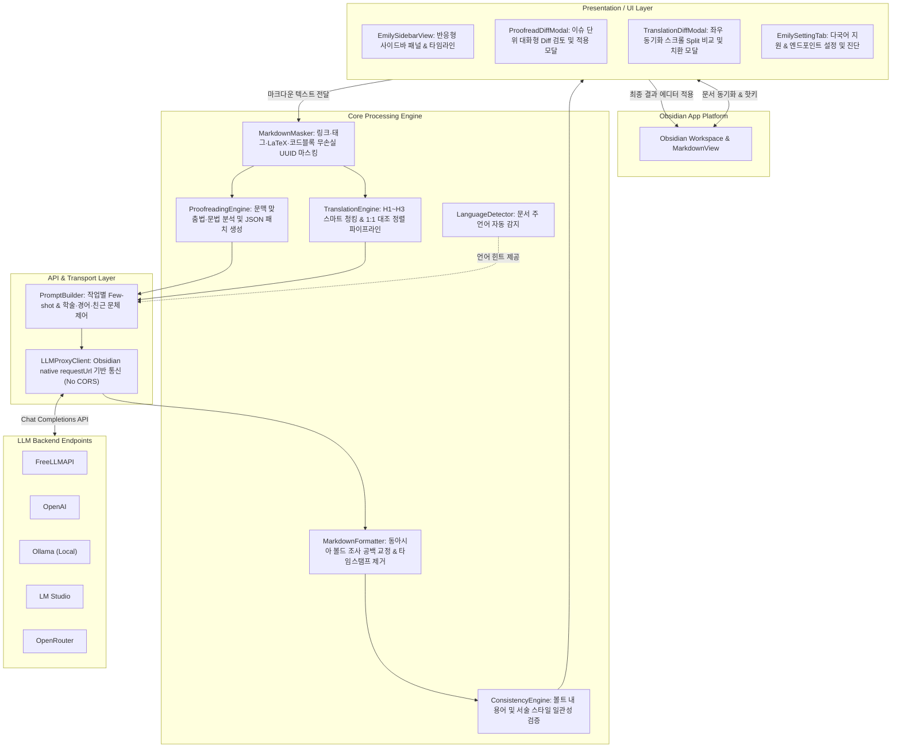
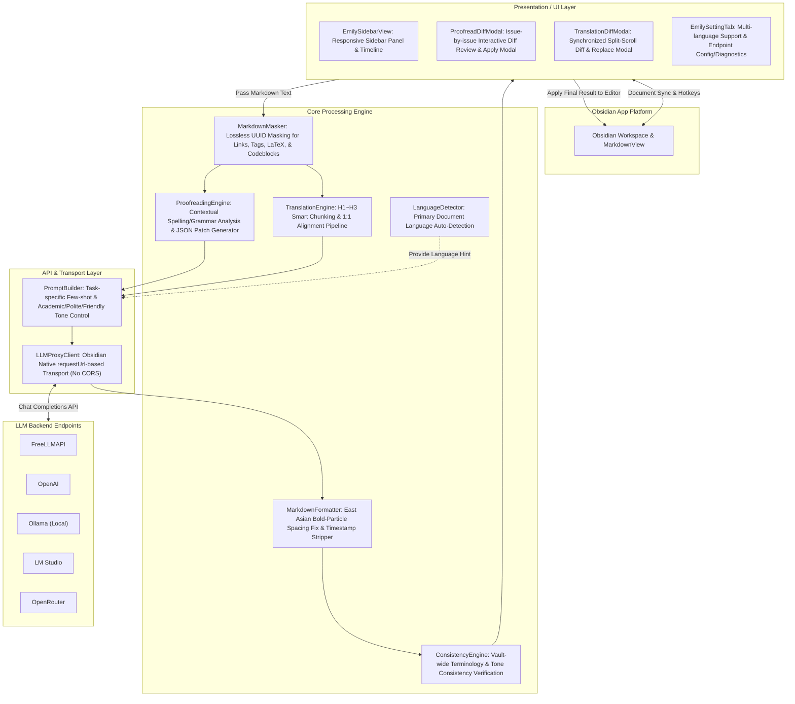

# 어시스턴트 에밀리


<p align="center">
  옵시디언 마크다운 지능형 무손실 교열 · 맥락 인식 전문 번역 AI 페어 어시스턴트 플러그인
</p>

<p align="center">
  <a href="https://github.com/sparklings/emily/releases"></a>
  <a href="https://obsidian.md"></a>
  <a href="LICENSE"></a>
  <a href="#-시스템-아키텍처-및-구조-system-architecture"></a>
  <a href="#-보안-프라이버시-및-규정-준수-고지-security-privacy--disclosures"></a>
  <a href="#-개요-overview"></a>
</p>

<p align="center">
  <a href="#assistant-emily"><b>🇺🇸 English</b></a> | <a href="#어시스턴트-에밀리"><b>🇰🇷 한국어</b></a>
</p>

---

## 📖 목차

1. [개요 (Overview)](#-개요-overview)
2. [시스템 아키텍처 및 구조 (System Architecture)](#-시스템-아키텍처-및-구조-system-architecture)
3. [상세 기능 (Detailed Features)](#-상세-기능-detailed-features)
   - [1. 무손실 지능형 마크다운 교열 (Lossless Proofreading)](#1-무손실-지능형-마크다운-교열-lossless-proofreading)
   - [2. 맥락 인식 전문 번역 (Context-Aware Translation)](#2-맥락-인식-전문-번역-context-aware-translation)
   - [3. 마크다운 타이포그래피 및 서식 정규화 (Typography Normalizer)](#3-마크다운-타이포그래피-및-서식-정규화-typography-normalizer)
   - [4. 사용자 맞춤 자유 지시 (Custom Natural Instructions)](#4-사용자-맞춤-자유-지시-custom-natural-instructions)
   - [5. 대화형 Diff 검토 (Interactive Diff Review)](#5-대화형-diff-검토-interactive-diff-review)
4. [설치 및 환경 설정 (Installation & Setup)](#-설치-및-환경-설정-installation--setup)
   - [플러그인 설치 방법](#플러그인-설치-방법)
   - [AI 백엔드 엔드포인트 연결 가이드](#ai-백엔드-엔드포인트-연결-가이드)
5. [보안, 프라이버시 및 규정 준수 고지 (Security, Privacy & Disclosures)](#-보안-프라이버시-및-규정-준수-고지-security-privacy--disclosures)
   - [외부 네트워크 통신 고지 (Network Usage)](#외부-네트워크-통신-고지-network-usage)
   - [볼트 파일 접근 및 권한 (Vault File Access)](#볼트-파일-접근-및-권한-vault-file-access)
   - [계정 및 요금 정책 (Account & Monetization)](#계정-및-요금-정책-account--monetization)
   - [원격 분석 및 광고 배제 (Telemetry & Advertisements)](#원격-분석-및-광고-배제-telemetry--advertisements)
6. [오픈소스 프로젝트 크레딧 및 감사의 글 (Acknowledgements & Open Source Credits)](#-오픈소스-프로젝트-크레딧-및-감사의-글-acknowledgements--open-source-credits)
7. [라이선스 (License)](#-라이선스-license)

---

## 🌟 개요 

**Assistant Emily** 는 옵시디언(Obsidian) 환경에서 학술 연구, 기술 문서 작성, 지식 정리 및 번역 작업을 수행하는 사용자를 위해 설계된 **데스크톱 전용 지능형 AI 페어 어시스턴트 플러그인** 입니다.

일반적인 AI 도구들은 마크다운 문서를 다룰 때 YAML 프론트매터, 옵시디언 내부 링크(`[[노트명]]`), 태그(`#tag`), 수식(`$...$`), 콜아웃 블록(`> [!note]`) 등을 훼손하거나 변형시키는 문제를 안고 있습니다. Assistant Emily는 이러한 문제를 극복하기 위해 **독자적인 문법 마스킹 파이프라인(Syntax Masking Pipeline)** 을 기반으로 설계되었습니다.

### 핵심 가치
* **100% 무손실 보존(Lossless Preservation)** : 원본 문서의 고유한 메타데이터와 옵시디언 고유 문법을 보호합니다.
* **학술 및 전문 문서에 최적화** : 대용량 문서에 대한 지능형 스마트 청킹(Smart Chunking), 1:1 문단 대조 번역(Bilingual Alignment), 코드 블록 내부 주석 선택 번역을 지원합니다.
* **로컬 AI 및 프라이버시 존중** : OpenAI 공식 API뿐만 아니라 `FreeLLMAPI`, 로컬 Ollama, LM Studio, vLLM, OpenRouter 등 OpenAI 호환 엔드포인트를 폭넓게 지원합니다.

---

## 🏗️ 시스템 아키텍처 및 구조

Assistant Emily는 단일 파일 스크립트 형태를 탈피하여, 모듈형 아키텍처로 구현되었습니다.



### 소스 디렉터리 구조

```
src/
├── api/
│   ├── llmClient.ts           # Obsidian requestUrl 기반의 OpenAI 호환 통신 클라이언트
│   └── promptBuilder.ts       # 교열/번역/자유지시 모드별 시스템 프롬프트 및 Few-shot 템플릿
├── core/
│   ├── consistencyEngine.ts   # 문서 간 어휘 및 스타일 일관성 검증 엔진
│   ├── languageDetector.ts    # 문서 언어 자동 감지 유틸리티
│   ├── markdownFormatter.ts   # 동아시아 언어 볼드체 공백 보정 및 타임스탬프 클리너
│   ├── markdownMasker.ts      # UUID 토큰 기반 마크다운 특수 문법 무손실 마스킹 엔진
│   ├── proofreadingEngine.ts  # 지능형 교열 및 Diff 항목 파싱 엔진
│   └── translationEngine.ts   # 스마트 청킹 및 문단별 1:1 대조 번역 엔진
├── i18n/
│   ├── index.ts               # 다국어 리소스 로더 및 번역 헬퍼
│   ├── types.ts               # 엄격한 다국어 번역 키 타입 정의
│   └── locales/               # ko, en, de, es, fr, ja, ru, zh 로케일 리소스
├── types/
│   ├── proofread.ts           # 교열 이슈 및 Diff 데이터 모델
│   ├── settings.ts            # 플러그인 환경 설정 인터페이스 및 기본값
│   └── translation.ts         # 번역 옵션 및 청크 데이터 모델
├── utils/
│   ├── domUtils.ts            # DOM 조작 및 UI 헬퍼
│   └── systemInfo.ts          # 시간대 및 시스템 상태 유틸리티
├── views/
│   ├── proofreadDiffModal.ts  # 교열 차이점 대화형 검토 모달
│   ├── settingsTab.ts         # 옵시디언 환경 설정 탭
│   ├── sidebarView.ts         # 반응형 메인 사이드바 패널
│   └── translationDiffModal.ts# 번역 좌우 분할 비교(Split Diff) 검토 모달
├── constants.ts               # 플러그인 전역 상수 및 뷰 ID
└── main.ts                    # 플러그인 라이프사이클 관리 및 커맨드/이벤트 등록
```

---

## 🚀 상세 기능

### 1. 무손실 지능형 마크다운 교열 (Lossless Proofreading)
* **문맥 기반 오탈자 및 문법 교정** : 단순 규칙 기반 검사를 넘어, LLM의 문맥 이해력을 활용하여 맞춤법, 띄어쓰기, 어색한 조사, 주술 호응 관계를 지능적으로 바로잡습니다.
* **문법 마스킹 보호** : 옵시디언 위키링크(`[[Note]]`, `[[Note|Alias]]`), 태그(`#tag`), 콜아웃 헤더(`> [!tip]`), 인라인/블록 LaTeX 수식(`$...$`, `$$...$$`), 인라인 코드 및 코드 블록 전체를 UUID 토큰으로 안전하게 보호한 뒤 교열을 수행하여 원본 서식이 절대 깨지지 않습니다.
* **인터랙티브 Diff 모달**
  * 발견된 모든 교정 항목을 목록화하여 표시합니다.
  * 항목별로 개별 적용 여부를 체크박스로 자유롭게 켜고 끌 수 있습니다.
  * 항목을 클릭하면 에디터의 해당 위치로 즉시 스크롤되어 전후 맥락을 직관적으로 확인할 수 있습니다.

### 2. 맥락 인식 전문 번역 (Context-Aware Translation)
* **3가지 작업 범위(Scope) 지원**
  * **선택 영역(Selection)** : 블록 지정된 텍스트만 빠르게 번역.
  * **전체 문서(All Document)** : 문서 전체의 H1~H6 헤더 계층 구조를 보존하며 번역.
  * **문단별 1:1 대조 병렬 번역(Paragraph Bilingual)** : 원문 문단 바로 아래에 번역 문단을 1:1로 배치하여 논문이나 외신 번역 검토 시 최적의 가독성을 제공합니다.
* **문체 및 어조 맞춤 설정**
  * 문체: `학술체(Academic)`, `경어체(Polite)`, `친근체(Friendly)`
  * 스타일: `직역(Literal)`, `균형(Balanced)`, `자연스러운 의역(Free Natural)`
* **코드 블록 주석 전용 번역 스위치**
  * 프로그래밍 코드 블록(`python`, `typescript`, `cpp` 등) 내부의 코드 로직, 변수명, 함수명은 100% 보존하면서 오직 주석(`//`, `#`, `/* ... */`)만 자연스럽게 번역할 수 있습니다.
* **스마트 청킹(Smart Chunking)**
  * LLM의 단일 응답 토큰 한계를 초과하는 대용량 문서는 H1~H3 헤더 및 문단 경계를 분석하여 무결성을 유지하며 분할 번역한 뒤 하나로 완벽하게 재조립합니다.

### 3. 마크다운 타이포그래피 및 서식 정규화 (Typography Normalizer)
* **동아시아 언어 볼드 공백 자동 보정(East Asian Bold Spacing Normalizer)**
  * 한국어, 일본어, 중국어 환경에서 마크다운 볼드 구문 뒤에 조사가 바로 붙을 경우(`**중요한**것은`), 옵시디언 에디터의 렌더링 규칙에 따라 볼드 서식이 풀리거나 깨지는 현상을 방지하기 위해 표준적인 공백 규칙을 자동으로 정규화합니다.
* **유튜브/강의 스크립트 타임스탬프 클리너**
  * 영상 자막이나 강의 녹취록에서 빈번하게 발생하는 타임스탬프(`12:34`, `01:23:45`)를 즉시 제거하고, 줄 단위로 잘려진 파편화된 문장들을 하나의 완성도 높은 문단으로 매끄럽게 재구성합니다.

### 4. 사용자 맞춤 자유 지시 (Custom Natural Instructions)
* 사용자가 원하는 임의의 자연어 지시(예: *"핵심 개념을 옵시디언 콜아웃 블록으로 감싸줘"*, *"글 전체의 결론을 3줄 요약 불릿으로 하단에 추가해줘"*)를 입력창에 적어 손쉽게 적용할 수 있습니다.

### 5. 대화형 Diff 검토 (Interactive Diff Review)
* 사이드바 하단의 세션 이력 카드에서 과거 실행 결과를 언제든지 다시 열람할 수 있습니다.
* 과거 세션 결과를 다시 열 때는 **추가 LLM API 호출이나 토큰 소모가 전혀 발생하지 않으며(Zero-Token)**, 좌우 분할 스크롤(Synchronized Split View) 화면에서 원본과 수정본을 안전하게 비교 검토한 뒤 원하는 방식으로 문서에 적용할 수 있습니다.
* **데스크톱 편의성**: `Ctrl+Enter` / `Cmd+Enter` 글로벌 단축키 실행, 한글 IME 조합 중복 방지, 실수로 인한 모달 닫힘 방지(Shake 효과)가 적용되어 있습니다.

---

## ⚙️ 설치 및 환경 설정 

### 플러그인 설치 방법

#### 1. 깃허브 릴리즈 수동 설치 (권장)
1. [GitHub Releases](https://github.com/sparklings/emily/releases)에서 최신 버전의 **`main.js`**, **`manifest.json`**, **`styles.css`** 3개 파일을 다운로드합니다.
2. 옵시디언 보관함(Vault) 폴더로 이동하여 아래 경로를 생성하고 파일을 배치합니다:
   ```
   <내 옵시디언 보관함>/
   └── .obsidian/
       └── plugins/
           └── assistant-emily/
               ├── main.js
               ├── manifest.json
               └── styles.css
   ```
3. 옵시디언의 **설정(Settings) > 커뮤니티 플러그인(Community plugins)** 에서 설치된 플러그인 목록을 새로고침하고, **Assistant Emily** 토글을 켭니다.

#### 2. BRAT(Beta Reviewers Auto-update Tester)을 통한 설치
1. 옵시디언 BRAT 플러그인 설정에서 **Add Beta plugin** 을 클릭합니다.
2. 리포지토리 주소 `sparklings/emily`를 입력하여 추가합니다.

---

### AI 백엔드 엔드포인트 연결 가이드

옵시디언 **설정 > Assistant Emily** 탭에서 사용 중인 LLM 백엔드 정보에 맞추어 설정하십시오:

| 서비스 유형 | API Base URL 권장값 | API Key | 권장 모델명 |
| :--- | :--- | :--- | :--- |
| **FreeLLMAPI / 무료 프록시** | `https://your-freellmapi-endpoint/v1` | 발급된 키 또는 임의값 | `auto` 또는 엔드포인트 제공 모델 |
| **OpenAI 공식** | `https://api.openai.com/v1` | OpenAI 발급 키 (`sk-...`) | `gpt-4o`, `gpt-4o-mini` |

> [!TIP]
> 설정 탭의 **`Test Connection & Say Hello`** 버튼을 클릭하면, 현재 설정된 엔드포인트와 모델의 실제 응답 지연 시간(ms)과 정상 통신 여부를 즉시 검증할 수 있습니다.

---

## 🔒 보안, 프라이버시 및 규정 준수 고지

옵시디언 커뮤니티 플러그인 공식 등록 가이드라인(Community Plugin Review Guidelines) 및 사용자 정보 보호 원칙에 따른 고지 사항입니다.

### 외부 네트워크 통신 고지
* **통신 목적**: Assistant Emily는 사용자가 명시적으로 요청한 교열, 번역, 맞춤 지시 작업을 수행하기 위해서만 외부 네트워크 통신을 진행합니다.
* **통신 대상 엔드포인트**: 오직 사용자가 플러그인 환경설정(`API Base URL`)에서 직접 지정한 엔드포인트(예: OpenAI 공식 API, `FreeLLMAPI`, 사용자 정의 프록시, 또는 `http://localhost:11434` 로컬 Ollama/LM Studio 서버)와만 통신합니다.
* **전송 데이터 범위**: 교열 및 번역 작업 실행 시 사용자가 활성화한 현재 노트의 본문(또는 선택 영역) 텍스트 및 프롬프트 명령문만 전송됩니다. 사용자의 다른 Vault 파일, 시스템 환경 정보, 브라우징 기록 등은 일체 수집하거나 전송하지 않습니다.
* **제3자 중계 서버 부재**: 플러그인은 옵시디언 표준 `requestUrl` API를 통해 지정된 엔드포인트와 직접 통신하며, 개발자 개인 서버나 비공개 중계 서버, 원격 분석 서버 등으로 데이터를 우회 전송하지 않습니다.

### 볼트 파일 접근 및 권한 
* **접근 범위 제한**: 플러그인은 사용자가 현재 에디터에서 열어두고 작업을 요청한 활성 볼트(Vault) 내의 마크다운 파일(`TFile`)에 대해서만 읽기 및 쓰기 작업을 수행합니다.
* **볼트 외부 파일시스템 접근 배제**: 사용자의 Vault 외부에 위치한 운영체제 파일 시스템이나 개인 디렉터리에 일체 접근하거나 탐색하지 않습니다.
* **문서 원형 보존 및 사용자 승인**: 모든 문서 수정은 대화형 Diff 검토 창을 거쳐 사용자가 명시적으로 승인(Apply)한 경우에만 옵시디언 표준 Vault API(`vault.modify`)를 통해 안전하게 반영됩니다.

### 계정 및 요금 정책
* 본 플러그인은 100% 무료 오픈소스(MIT) 소프트웨어이며, 플러그인 자체 사용을 위한 별도의 회원가입이나 전용 계정 로그인을 일체 요구하지 않습니다.
* AI 서비스 이용에 소요되는 토큰 비용은 사용자가 선택한 서비스 제공자(OpenAI, OpenRouter 등)의 정책에 따르며, 본 플러그인과는 무관합니다. 

### 원격 분석 및 광고 배제
* Google Analytics, Mixpanel, Sentry 등 어떠한 사용자 행동 추적 코드나 원격 분석 텔레메트리 모듈도 포함되어 있지 않습니다.
* 플러그인 UI 및 사이드바 내부에 스폰서 링크, 배너 광고, 후원 유도 팝업 등을 일체 표시하지 않습니다.

---

## 💖 오픈소스 프로젝트 크레딧 및 감사의 글

Assistant Emily는 전 세계 오픈소스 커뮤니티의 뛰어난 소프트웨어와 개발자분들의 헌신적인 기여가 있었기에 탄생할 수 있었습니다. 본 프로젝트에 직·간접적으로 힘이 되어준 소중한 프로젝트들에 진심으로 감사의 마음을 전합니다.

### 1. Obsidian
독보적인 지식 관리 및 제2의 뇌(Second Brain) 생태계를 구축해 온 **Obsidian 개발팀** 에 무한한 감사를 표합니다.
* **GitHub Repository**: [obsidianmd/obsidian-api](https://github.com/obsidianmd/obsidian-api) (공식 사이트: [obsidian.md](https://obsidian.md))
* 웹 표준 기술과 강력한 플러그인 아키텍처(`WorkspaceLeaf`, `MarkdownView`, `requestUrl`, 세밀한 디자인 토큰 변수 등) 덕분에 데스크톱 환경에서 완벽히 통합되는 네이티브 수준의 AI 페어 어시스턴트를 구축할 수 있었습니다.

### 2. FreeLLMAPI & 오픈 모델 생태계
누구나 자유롭고 부담 없이 인공지능의 혜택을 누릴 수 있도록 길을 열어준 **FreeLLMAPI** 및 OpenAI 호환 오픈 API 생태계의 모든 기여자분들께 깊이 감사드립니다.
* **GitHub Repository**: [tashfeenahmed/freellmapi](https://github.com/tashfeenahmed/freellmapi)
* 복잡하고 폐쇄적인 독점 API 의존성을 벗어나, 표준화된 인터페이스를 통해 다양한 로컬 모델과 프록시 백엔드를 유연하게 연동할 수 있는 튼튼한 토대가 되었습니다.

### 3. Pi Agent Architecture & Research 
Assistant Emily의 코드베이스는 외부 대형 에이전트 라이브러리 대신, 옵시디언 샌드박스 환경에 최적화된 **독립형 맞춤 클라이언트(`LLMProxyClient`)와 전용 파이프라인 엔진** 으로 직접 구현되었습니다.
* **GitHub Repository**: [earendil-works/pi](https://github.com/earendil-works/pi)
* 외부 SDK를 직접 번들링하는 대신 가볍고 날렵한 커스텀 엔진을 채택하였으나, 지능형 에이전트의 상태 관리, 컨텍스트 주입, 프롬프트 엔지니어링 및 도구 연계 워크플로우를 설계하는 과정에서 **Pi Agent (pi agent sdk)** 프로젝트가 제시한 선구적인 에이전트 아키텍처와 아이디어로부터 커다란 영감과 기술적 통찰을 얻었습니다. 오픈 에이전트 생태계를 개척해 나가는 Pi Agent 연구 및 개발진에 깊은 존경과 감사를 드립니다.

### 4. 오픈소스 도구 및 생태계
* **[TypeScript](https://www.typescriptlang.org/)** ([GitHub: microsoft/TypeScript](https://github.com/microsoft/TypeScript)): 복잡한 비동기 문서 처리 및 마크다운 AST 파이프라인을 견고하고 결함 없이 유지할 수 있게 해 준 최고의 개발 언어입니다.
* **[esbuild](https://esbuild.github.io/)** ([GitHub: evanw/esbuild](https://github.com/evanw/esbuild)): 초고속 번들링과 트리 셰이킹을 통해 최적화된 배포 번들을 순식간에 빌드해 준 고성능 빌더입니다.
* **[builtin-modules](https://github.com/sindresorhus/builtin-modules)** ([GitHub: sindresorhus/builtin-modules](https://github.com/sindresorhus/builtin-modules)): Node.js 런타임 의존성을 옵시디언 데스크톱 환경과 안전하게 조화시킬 수 있도록 기여해 주었습니다.

---

## 📄 라이선스 

Assistant Emily는 **[MIT License](LICENSE)** 에 따라 자유롭게 사용, 수정, 배포할 수 있는 오픈소스 소프트웨어입니다.
사용자 여러분의 피드백과 이슈 제보, Pull Request 기여를 언제나 환영합니다!


---


# Assistant Emily

<p align="center">
  <strong>Intelligent Markdown Proofreading & Translation Specialized AI Pair-Assistant for Obsidian</strong><br>
  Lossless Markdown Proofreading · Context-Aware Professional Translation AI Pair-Assistant Plugin
</p>

<p align="center">
  <a href="https://github.com/sparklings/emily/releases"></a>
  <a href="https://obsidian.md"></a>
  <a href="LICENSE"></a>
  <a href="#-system-architecture"></a>
  <a href="#-security-privacy--disclosures"></a>
  <a href="#-overview"></a>
</p>

<p align="center">
  <a href="#assistant-emily"><b>🇺🇸 English</b></a> | <a href="#어시스턴트-에밀리"><b>🇰🇷 한국어</b></a>
</p>

---

## 📖 Table of Contents

1. [Overview](#-overview)
2. [System Architecture](#-system-architecture)
3. [Detailed Features](#-detailed-features)
   - [1. Lossless Intelligent Markdown Proofreading](#1-lossless-intelligent-markdown-proofreading)
   - [2. Context-Aware Professional Translation](#2-context-aware-professional-translation)
   - [3. Markdown Typography & Formatting Normalization](#3-markdown-typography--formatting-normalization)
   - [4. Custom Natural Instructions](#4-custom-natural-instructions)
   - [5. Interactive Diff Review](#5-interactive-diff-review)
4. [Installation & Setup](#-installation--setup)
   - [Plugin Installation Methods](#plugin-installation-methods)
   - [AI Backend Endpoint Connection Guide](#ai-backend-endpoint-connection-guide)
5. [Security, Privacy & Disclosures](#-security-privacy--disclosures)
   - [External Network Communication Notice (Network Usage)](#external-network-communication-notice)
   - [Vault File Access & Permissions (Vault File Access)](#vault-file-access--permissions)
   - [Account & Monetization Policy (Account & Monetization)](#account--monetization-policy)
   - [Zero Telemetry & Ad-Free Policy (Telemetry & Advertisements)](#zero-telemetry--ad-free-policy)
6. [Acknowledgements & Open Source Credits](#-acknowledgements--open-source-credits)
7. [License](#-license)

---

## 🌟 Overview

**Assistant Emily** is a **desktop-only intelligent AI pair-assistant plugin** designed for Obsidian users engaged in academic research, technical documentation, knowledge management, and translation.

Conventional AI tools often corrupt or strip critical Markdown elements—such as YAML frontmatter, Obsidian internal links (`[[Note Name]]`), tags (`#tag`), LaTeX formulas (`$...$`), and callout blocks (`> [!note]`)—when modifying documents. Assistant Emily completely resolves this challenge through its proprietary **Syntax Masking Pipeline**.

### Core Values
* **100% Lossless Preservation**: Safely shields the document's original metadata and unique Obsidian syntax from corruption.
* **Optimized for Academic & Technical Writing**: Features smart chunking for large documents, 1:1 paragraph bilingual alignment, and selective translation for code block comments.
* **Local AI & Privacy First**: Universally supports OpenAI-compatible endpoints—ranging from official OpenAI API and `FreeLLMAPI` to local Ollama, LM Studio, vLLM, and OpenRouter.

---

## 🏗️ System Architecture

Assistant Emily moves beyond monolithic single-file scripts with a modular and robust software architecture.



### Source Directory Structure

```
src/
├── api/
│   ├── llmClient.ts           # OpenAI-compatible communication client powered by Obsidian requestUrl
│   └── promptBuilder.ts       # System prompts and few-shot templates for proofreading, translation, and custom instruction modes
├── core/
│   ├── consistencyEngine.ts   # Vault-wide terminology and writing style consistency engine
│   ├── languageDetector.ts    # Document primary language auto-detection utility
│   ├── markdownFormatter.ts   # East Asian bold spacing normalizer and timestamp stripper
│   ├── markdownMasker.ts      # Lossless UUID masking engine for Markdown and Obsidian syntax
│   ├── proofreadingEngine.ts  # Intelligent proofreading and diff-item parsing engine
│   └── translationEngine.ts   # Smart chunking and paragraph 1:1 bilingual translation engine
├── i18n/
│   ├── index.ts               # Multi-language resource loader and translation helper
│   ├── types.ts               # Type-safe i18n translation key definitions
│   └── locales/               # ko, en, de, es, fr, ja, ru, zh locale resources
├── types/
│   ├── proofread.ts           # Proofreading issue and diff data models
│   ├── settings.ts            # Plugin settings interface and default values
│   └── translation.ts         # Translation options and chunk data models
├── utils/
│   ├── domUtils.ts            # DOM manipulation and UI helpers
│   └── systemInfo.ts          # Timezone and system status utilities
├── views/
│   ├── proofreadDiffModal.ts  # Interactive proofreading diff review modal
│   ├── settingsTab.ts         # Obsidian settings tab
│   ├── sidebarView.ts         # Responsive main sidebar panel
│   └── translationDiffModal.ts# Split diff comparison review modal for translation
├── constants.ts               # Plugin-wide constants and view identifiers
└── main.ts                    # Plugin lifecycle management, commands, and event registration
```

---

## 🚀 Detailed Features

### 1. Lossless Intelligent Markdown Proofreading
* **Context-Aware Spelling and Grammar Correction**: Transcends rigid rule-based checkers by leveraging LLM contextual comprehension to fix spelling, spacing, awkward particles, and subject-predicate agreement.
* **Syntax Masking Protection**: Obsidian wikilinks (`[[Note]]`, `[[Note|Alias]]`), tags (`#tag`), callout headers (`> [!tip]`), inline and block LaTeX equations (`$...$`, `$$...$$`), and code blocks are securely converted into UUID placeholder tokens before LLM processing, guaranteeing zero corruption to original formatting.
* **Interactive Diff Modal**:
  * Displays all detected corrections in an organized list.
  * Allows selective toggling of individual edits via checkboxes.
  * Clicking an issue scrolls directly to its corresponding position in the editor for instant context verification.

### 2. Context-Aware Professional Translation
* **3 Translation Scopes**:
  * **Selection**: Rapidly translates only highlighted text blocks.
  * **All Document**: Translates the full document while preserving heading hierarchies (H1–H6).
  * **Paragraph Bilingual**: Places the translated paragraph immediately below the source paragraph in a 1:1 alignment, ideal for academic papers and international news reviews.
* **Tone & Style Customization**:
  * Tone: `Academic`, `Polite`, `Friendly`
  * Style: `Literal`, `Balanced`, `Free Natural`
* **Code Block Comments Only Translation Switch**:
  * Safely translates comments (`//`, `#`, `/* ... */`) while maintaining 100% integrity of code syntax, variable names, and function identifiers across programming languages (`python`, `typescript`, `cpp`, etc.).
* **Smart Chunking**:
  * For long documents exceeding single-turn LLM response token limits, the engine intelligently splits text along H1–H3 headers and paragraph boundaries, translating sequentially and reconstructing the document seamlessly.

### 3. Markdown Typography & Formatting Normalization
* **East Asian Bold Spacing Normalizer**:
  * In Korean, Japanese, and Chinese texts, when grammatical particles immediately follow bold markup (e.g., `**word**particle`), Obsidian's renderer may fail to render bold formatting correctly. The normalizer automatically standardizes whitespace to ensure pristine visual rendering.
* **YouTube / Lecture Script Timestamp Stripper**:
  * Strips recurring video timestamps (`12:34`, `01:23:45`) and reflows fragmented lines into fluent, readable prose paragraphs.

### 4. Custom Natural Instructions
* Execute arbitrary natural language commands directly in the prompt input field (e.g., *"Wrap key concepts in Obsidian callout blocks"*, *"Add a 3-bullet summary conclusion at the bottom"*).

### 5. Interactive Diff Review
* Re-inspect previous execution outputs at any time via the session history cards located at the bottom of the sidebar.
* **Zero-Token Re-review**: Reopening prior results consumes **zero additional LLM API calls or tokens**, letting you safely compare original and modified documents in a synchronized split-scroll view before applying changes.
* **Desktop Productivity**: Features `Ctrl+Enter` / `Cmd+Enter` global shortcuts, IME composition protection for Korean/CJK input, and modal shake effects to prevent accidental dismissal.

---

## ⚙️ Installation & Setup

### Plugin Installation Methods

#### 1. Manual GitHub Releases Installation (Recommended)
1. Download the latest **`main.js`**, **`manifest.json`**, and **`styles.css`** files from [GitHub Releases](https://github.com/sparklings/emily/releases).
2. Open your Obsidian Vault directory and create the following plugin folder path:
   ```
   <Your-Obsidian-Vault>/
   └── .obsidian/
       └── plugins/
           └── assistant-emily/
               ├── main.js
               ├── manifest.json
               └── styles.css
   ```
3. In Obsidian, navigate to **Settings > Community plugins**, click **Reload installed plugins**, and enable the **Assistant Emily** toggle.

#### 2. Installation via BRAT (Beta Reviewers Auto-update Tester)
1. In the Obsidian BRAT plugin settings, click **Add Beta plugin**.
2. Enter the repository path `sparklings/emily` and add the plugin.

---

### AI Backend Endpoint Connection Guide

Navigate to Obsidian **Settings > Assistant Emily** and configure your preferred LLM backend:

| Service Type | Recommended API Base URL | API Key | Recommended Model |
| :--- | :--- | :--- | :--- |
| **FreeLLMAPI / Free Proxy** | `https://your-freellmapi-endpoint/v1` | Issued Key or Arbitrary Value | `auto` or Endpoint-provided model |
| **OpenAI Official** | `https://api.openai.com/v1` | OpenAI API Key (`sk-...`) | `gpt-4o`, `gpt-4o-mini` |
| **Ollama (Local Free AI)** | `http://localhost:11434/v1` | **Leave blank** | `llama3`, `qwen2.5`, `mistral` |
| **LM Studio (Local GUI)** | `http://localhost:1234/v1` | **Leave blank or arbitrary string** | `auto` |
| **OpenRouter** | `https://openrouter.ai/api/v1` | OpenRouter Key (`sk-or-...`) | `anthropic/claude-3.5-sonnet` |

> [!TIP]
> Click the **`Test Connection & Say Hello`** button in the settings tab to instantly verify network connectivity and measure real-time response latency (ms) for the configured endpoint and model.

---

## 🔒 Security, Privacy & Disclosures

Compliant with Obsidian's Community Plugin Review Guidelines and user privacy principles.

### External Network Communication Notice
* **Purpose of Communication**: Assistant Emily initiates network requests exclusively to execute user-requested proofreading, translation, and custom instruction tasks.
* **Target Endpoints**: Communicates solely with the endpoint explicitly designated by the user in plugin settings (`API Base URL`)—such as official OpenAI API, `FreeLLMAPI`, custom proxies, or local servers (`http://localhost:11434` for Ollama/LM Studio).
* **Scope of Transmitted Data**: Only the active note text (or selected text) and prompt instructions are transmitted during execution. No other vault files, environment variables, system configurations, or browsing histories are ever accessed or transmitted.
* **No Intermediary Relay Servers**: The plugin communicates directly with the designated endpoint via Obsidian's native `requestUrl` API, without routing through developer personal servers, telemetry endpoints, or private proxies.

### Vault File Access & Permissions
* **Scoped Access**: File read and write operations are strictly limited to the active Markdown file (`TFile`) explicitly opened and requested by the user.
* **No Access Outside Vault**: Completely restricted from scanning or accessing filesystem paths or directories outside the Obsidian Vault.
* **Preservation & Explicit Approval**: All document modifications require explicit user confirmation (via the interactive Diff review modal) before changes are written through Obsidian's native `vault.modify` API.

### Account & Monetization Policy
* **100% Free & No Registration**: Assistant Emily is 100% free open-source software (MIT). It requires no proprietary account creation, sign-up, or login.
* **Decoupled API Costs**: AI token usage fees depend entirely on the provider chosen by the user (OpenAI, OpenRouter, etc.). When using local AI (Ollama, LM Studio) or free proxies (`FreeLLMAPI`), operation is completely free with zero financial cost.

### Zero Telemetry & Ad-Free Policy
* **Zero Telemetry**: Contains zero tracking scripts, diagnostic analytics, or telemetry modules (no Google Analytics, Mixpanel, Sentry, etc.).
* **Ad-Free Experience**: The plugin interface and sidebar contain no advertisements, sponsored banners, or donation popups.

---

## 💖 Acknowledgements & Open Source Credits

Assistant Emily was made possible thanks to the outstanding software and generous contributions of the global open-source community. We express our deepest gratitude to the following projects:

### 1. Obsidian
Our sincere gratitude goes to the **Obsidian Team** for building and fostering an exceptional second-brain and knowledge management ecosystem.
* **GitHub Repository**: [obsidianmd/obsidian-api](https://github.com/obsidianmd/obsidian-api) (Official Website: [obsidian.md](https://obsidian.md))
* Built on modern web technologies and Obsidian's powerful plugin architecture (`WorkspaceLeaf`, `MarkdownView`, `requestUrl`, granular theme design tokens), making it possible to create a deeply integrated, native desktop AI pair-assistant.

### 2. FreeLLMAPI & Open Model Ecosystem
Our profound thanks to **FreeLLMAPI** and the entire OpenAI-compatible open API ecosystem for democratizing access to cutting-edge AI.
* **GitHub Repository**: [tashfeenahmed/freellmapi](https://github.com/tashfeenahmed/freellmapi)
* It provided a flexible foundation to move beyond proprietary vendor locks and seamlessly interface with various local models and proxy backends through a unified standard.

### 3. Pi Agent Architecture & Research
Assistant Emily's codebase is implemented directly with an **independent custom client (`LLMProxyClient`) and specialized pipeline engines** optimized for Obsidian's sandbox environment, rather than relying on heavy external agent frameworks.
* **GitHub Repository**: [earendil-works/pi](https://github.com/earendil-works/pi)
* While choosing a lightweight and agile custom engine over bundling bulky external SDKs, we gained tremendous inspiration and technical insight into agent state management, context injection, prompt engineering, and tool orchestration workflows from the pioneering ideas of the **Pi Agent (pi agent sdk)** project. We extend our deepest respect and gratitude to the Pi Agent researchers and engineering team pioneering the open agent ecosystem.

### 4. Open Source Tools & Ecosystem
* **[TypeScript](https://www.typescriptlang.org/)** ([GitHub: microsoft/TypeScript](https://github.com/microsoft/TypeScript)): The premier language that keeps complex asynchronous document processing and Markdown AST pipelines robust, strictly typed, and reliable.
* **[esbuild](https://esbuild.github.io/)** ([GitHub: evanw/esbuild](https://github.com/evanw/esbuild)): High-performance builder delivering instantaneous builds, fast bundling, and efficient tree-shaking for release distributions.
* **[builtin-modules](https://github.com/sindresorhus/builtin-modules)** ([GitHub: sindresorhus/builtin-modules](https://github.com/sindresorhus/builtin-modules)): Contributed to cleanly harmonizing Node.js runtime dependencies within Obsidian's desktop Electron environment.

---

## 📄 License

Assistant Emily is open-source software released under the **[MIT License](LICENSE)**.
Feedback, issue reports, and pull request contributions are always welcome!
